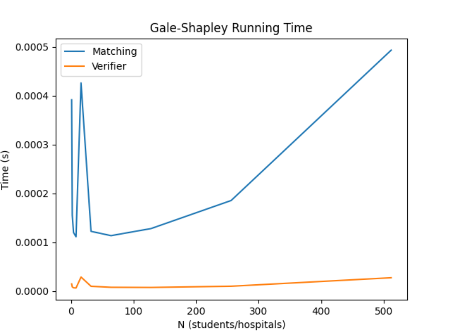

# Programming Assignment 1: Gale–Shapley Stable Matching

## Students
Natahja Graddy - UFID: 6941-2034
Nathan King - UFID: 7218-0427

## Build/Compilation Instructions
Build/Compilation not required, as this project is in Python.

## Files
ProgrammingAssignment1.py: Runs Gale Shapley Algorithm.
validity_check.py: Contains 2 functions, one for checking validity of output, one for checking stability of matchings.
exampleData.txt: File to be read into GS Algorithm.
test-files: folder that contians example input and output files to check matcher and verifier
graph.py and Runtime.py files:used to compile a visual of our code's algorithm runtime

## Running the Matcher
To generate a stable matching, run:

```bash
python ProgrammingAssignment1.py example1.in
```
**Replace the (1) with numbers 1-4 to test other files. Expected output provided in test-files folder.

## Running the Verifier
The verifier is implemented in `validity_check.py` as helper functions that
check the validity and stability of the produced matching.
These checks are executed automatically when the matcher is run.
To test the verifier independently from the matcher update and run the verifier_test.py file


## Assumptions
The number of hospitals and students is equal.
Each hospital and student has a complete, ordered preference list of size n where n is the number of hospitals.
Input files follow the format specified in the assignment.
Python 3 is used for execution.

### Example Input

2
1 2
2 1
2 1
1 2

### Example Output
1 1
2 2

### Gale-Shapley Runtime Graph


### Notes
The graph.py and Runtime.py files were used to compile a visual of our code's algorithm runtime. These files do not
need to be compiled or ran for the matcher or verifier to work
